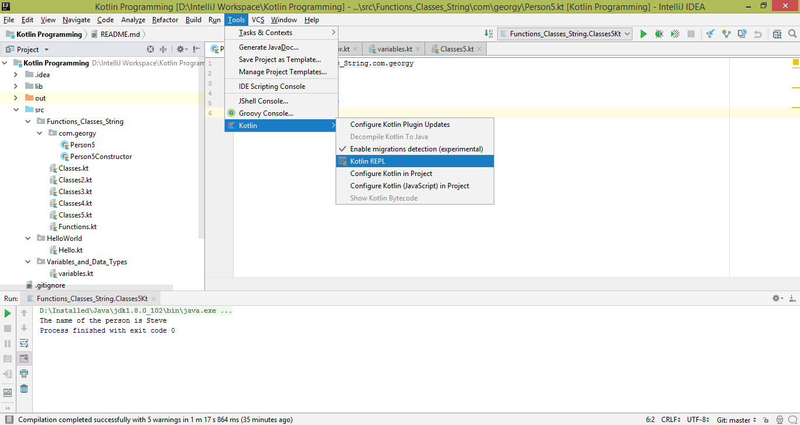
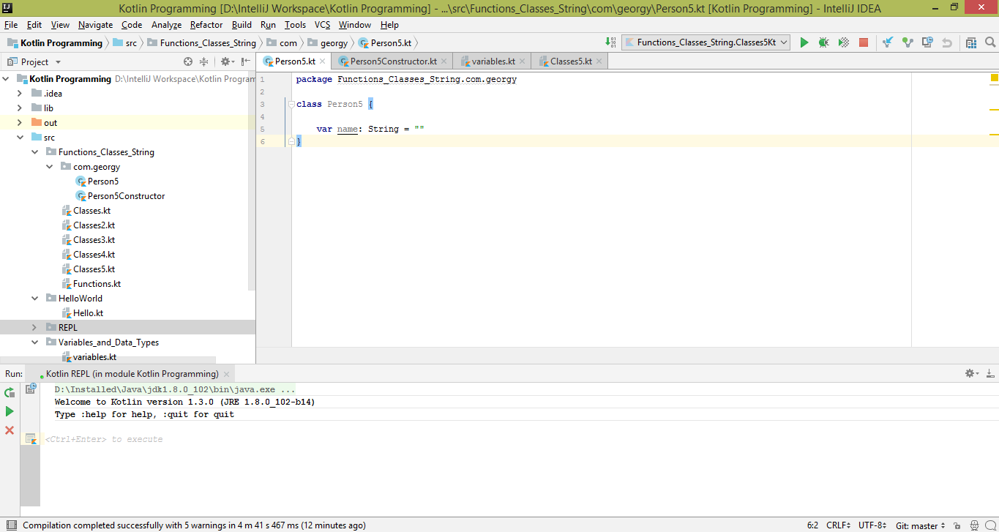
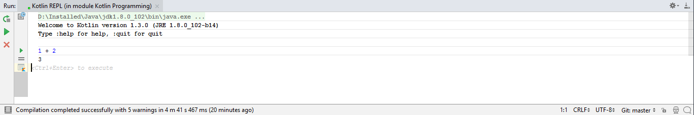
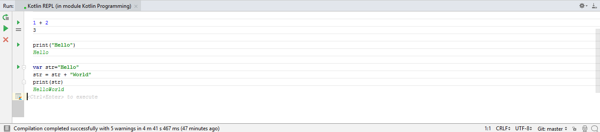

## Kotlin Programming - REPL 

REPL stands for Read-Eval-Print-Loop. The main purpose of REPL is to execute program code in REPL command line window as quickly as possible. In order to use REPL command line in 'IntelliJ IDEA', Tools->Kotlin->Kotlin REPL
 

After clicking the Kotlin REPL, we can see REPL Window similar to the below figure.
 

In order to perform arithmetic operation (say add), type 1 + 2. Then press Ctrl+Enter key in Windows and press Cmd+Enter in Mac. Then you can see the following result.
       

 Similarly we can run program code and do it in REPL command line.
 

